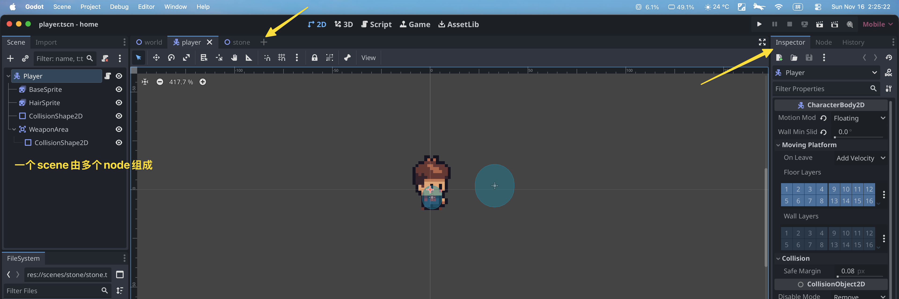

创建游戏: 点击编辑器上面的 + 号 (Add a new scene), 点击左侧栏 2D Scene 命名为 Game 作为根节点

创建角色: 点击编辑器上面的 + 号 (Add a new scene), 点击左侧栏 Other Node - CharacterBody2D 作为根节点

点击某个节点, 从右侧 Inspector 可以看出, 2D Scene 和 CharacterBody2D 都是节点, 只不过属性不同

---

