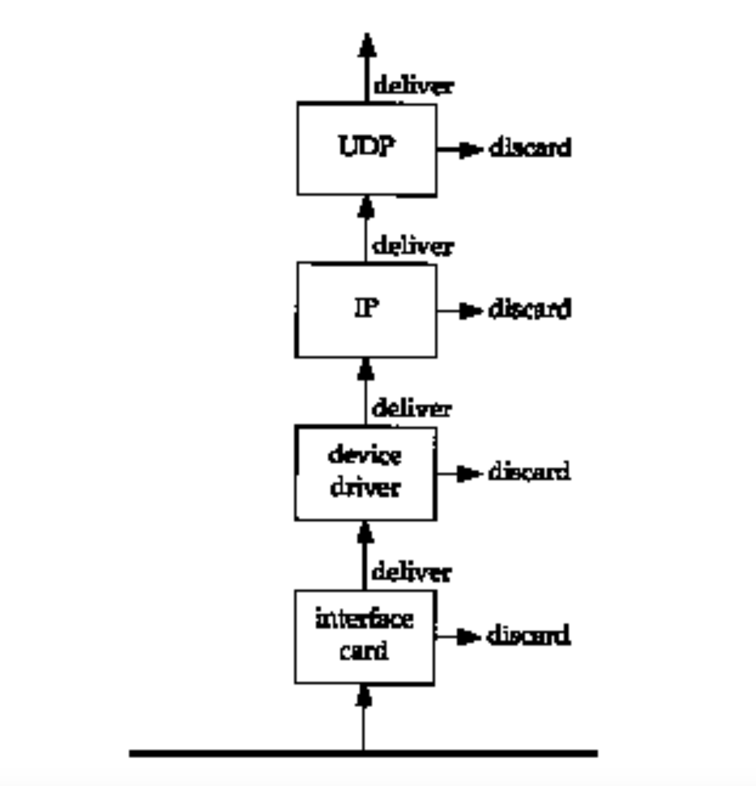

## Big Endian & Little Endian

A big-endian system stores the most significant byte of a word at the smallest memory address and the least significant byte at the largest. A little-endian system, in contrast, stores the least-significant byte at the smallest address. 只要记住小端是低字节存储在低地址就好了, 注意顺序以字节为单位, 而不是完全倒回来, 如图:

首先，为什么会有小端字节序？

答案是，计算机电路先处理低位字节，效率比较高，因为计算都是从低位开始的。所以，计算机的内部处理都是小端字节序。

但是，人类还是习惯读写大端字节序。所以，除了计算机的内部处理，其他的场合几乎都是大端字节序，比如网络传输和文件储存。

一般分为两种即网络字节序和主机字节序, 前者统一为大端, 后者则因 CPU 而异, 为了在信息传输时，屏蔽掉不同硬件结构上的字节序的差异，TCP/IP协议规定，所有在网络上传输的多字节整数都以大端序编码，所以大端序就是`网络字节序`. 再讲主机上的多字节整数发送到网络中时，必须将主机字节序转换到网络字节序。从网络中接收到多字节整数时也要讲网络字节序转换为主机字节序。当然如果主机字节序本来就是大端序，那么转换函数就什么都没做。

## MAC Address

MAC地址是以太网二层使用的一个48bit（6字节十六进制数）的地址，用来标识设备位置。MAC地址分成两部分，前24位是组织唯一标识符（OUI, Organizationally unique identifier），后24位由厂商自行分配。

MAC地址有单播、组播、广播之分。单播地址(unicast address)表示单一设备, 多播地址或者组播地址(multicast address、group address)表示一组设备, 广播地址(broadcast address)是组播的特例，表示所有地址，用全F表示：FF-FF-FF-FF-FF-FF。当然，三层的IP地址也有单播、组播、广播之分。

关于组播地址，有这么个误解：MAC地址第1字节必须是0x01才表示组播地址，连TCP/IP详解上也这么说（见中文版12.4.2第一段）。IEEE 802.3里面已经明确说明了只要第48bit是1就表示组播地址，所以无论MAC地址第1字节是0x01、0xC1或者是0x33都表示这个MAC地址 是组播地址（以0x33开头的表示IPV6对应的二层组播地址）。之所以有这样的误解，是因为到目前为止，大部分组播MAC地址的第1字节都是0x01。 如：

- 01-80-C2-00-00-00(STP协议使用)

- 01-80-C2-00-00-01(MAC Control的PAUSE帧使用)

- 01-80-C2-00-00-02(Slow Protocol: 802.3ah OAM/ LACP 协议都用这个地址，这个地址很有故事，有多少软件处理这个地址会出问题啊！)

- 01-00-5E-xx-xx-xx(IP组播地址对应的二层组播地址)。

之所以大部分组播地址都以01-80-C2和01-00-5E开头，那是因为使用这些组播地址的协议都是带头大哥IEEE和IANA名下的，它们的OUI 分别是00-80-C2和00-00-5E是，变成组播地址就是01-80-C2和01-00-5E了，当然，除了带头大哥霸占的这些组播地址，还有 01-00-0C-CC-CC-CC这样的地址，这个地址是Cisco霸占的，Cisco的OUI是00-00-0C。

## Broadcasting and Multicasting

**Broadcasting and multicasting only apply to UDP**, where it makes sense for an application to send a single message to multiple recipients. TCP is a connection-oriented protocol that implies a connection between two hosts (specified by IP addresses) and one process on each host (specified by port numbers).

Consider a set of hosts on a shared network such as an Ethernet. Each Ethernet frame contains the source and destination Ethernet addresses (48-bit values). Normally each Ethernet frame is destined for a single host. The destination address specifies a single interface-called a *unicast.* In this way communication between any two hosts doesn't bother any of the remaining hosts on the cable (except for possible contention for the shared media).

There are times, however, when a host wants to send a frame to every other host on the cable-called a *broadcast.* We saw this with ARP and RARP. Multicasting fits between unicasting and broadcasting: the frame should be delivered to a set of hosts that belong to a multicast group.

To understand broadcasting and multicasting we need to understand that filtering takes place on each host, each time a frame passes by on the cable. 

First, the **interface card** sees every frame that passes by on the cable and **makes a decision** whether to receive the frame and deliver it to the device driver. Normally the interface card receives only those frames whose destination address is either the hardware address of the interface or the broadcast address. 

> Note that, most interfaces can be placed into a promiscuous mode whereby they receive a copy of every frame. This mode is used by tcpdump, for example.

Today most interfaces can also be configured to receive frames whose destination address is a multicast address, or some subset of multicast addresses. On an Ethernet, a multicast address has the low-order bit of the high-order byte turned on. In hexadecimal this bit looks like 01:00:00:00:00:00. (We can consider the Ethernet broadcast address, ff:ff:ff:ff:ff:ff as a special case of the Ethernet multicast address.)

If the interface card receives the frame, it is passed to the device driver. (One reason the interface card might discard the frame is if the Ethernet checksum is incorrect.) Additional filtering is performed by the device driver. First, the frame type must specify a protocol that is supported (IP, ARP, etc.). Second, additional multicast filtering may be performed, to check whether the host belongs to the addressed multicast group.

The device driver then passes the frame to the next layer, such as IP, if the frame type specifies an IP datagram. IP performs more filtering, based on the source and destination IP addresses, and passes the datagram up to the next layer (such as TCP or UDP) if all is well.

Each time UDP receives a datagram from IP, it performs filtering based on the destination port number, and sometimes the source port number too. If no process is currently using the destination port number, the datagram is discarded and an ICMP port unreachable message is normally generated. (TCP performs similar filtering based on its port numbers.) If the UDP datagram has a checksum error, UDP silently discards it.

The problem with broadcasting is the processing load that it places on hosts that aren't interested in the broadcasts. Consider an application that is designed to use UDP broadcasts. If there are 50 hosts on the cable, but only 20 are participating in the application, every time one of the 20 sends a UDP broadcast, the other 30 hosts have to process the broadcast, all the way up through the UDP layer, before the UDP datagram is discarded. The UDP datagram is discarded by these 30 hosts because the destination port number is not in use.

The intent of multicasting is to reduce this load on hosts with no interest in the application. With multicasting a host specifically joins one or more multicast groups. If possible, the interface card is told which multicast groups the host belongs to, and only those multicast frames are received.

参考:

- [组播MAC地址和各类IP地址 - 苍月代表我 - 博客园](https://www.cnblogs.com/lifan3a/articles/6650936.html)
- [Endianness](https://en.wikipedia.org/wiki/Endianness)
- [理解字节序 - 阮一峰的网络日志](https://www.ruanyifeng.com/blog/2016/11/byte-order.html)
- [Errata Security: How to teach endian](https://blog.erratasec.com/2016/11/how-to-teach-endian.html)
- [网络字节序与主机字节序 | Andrew's Blog](https://andrewpqc.github.io/2020/01/12/little-big-endian/)

